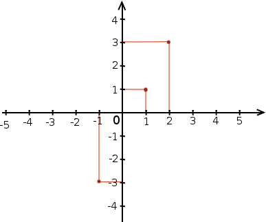
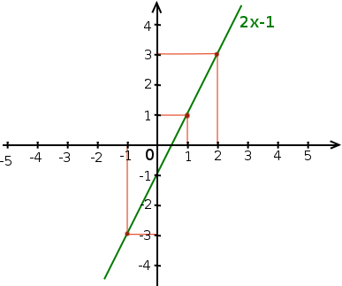

=============================================
Les équations du premier degré à une inconnue
=============================================

Introduction
============

Les équations du premier degré à une inconnue (on parle aussi d'équations
linéaires à une inconnue sont un outil permettant de résoudre une certaine
catégorie de problèmes. Par conséquent il est intéressant de voir quel type
de problème on cherche à résoudre avant de voir la méthode elle-même. Après
cela nous verrons une méthode pour résoudre systèmatiquement les équations de
ce type puis quelques éléments de culture mathématique les entourant.

Qu'est-ce que c'est ?
---------------------

Il y a beaucoup de problèmes où l'on recherche une certaine quantité par
rapport à certaines contraintes :

- Combien ce plein va-t-il me coûter ?
- Je n'ai que 20€ sur moi, combien d'œufs puis-je acheter ?
- Cette bougie durera-t-elle jusqu'au matin si je l'allume maintenant ?
- À quelle distance se trouve l'orage dont je viens d'entendre le tonnerre ?
- Qu'est-ce qui est le plus avantageux par rapport à ma consommation, un
  forfait ou un prix à la minute ?

Tout ces problèmes ont en commun qu'on cherche une quantité exacte et pas un
rapport de force (à l'image de « Qu'est-ce qui est le plus lourd entre un
litre d'eau et un litre de lait ? »). Ils ont également en commun qu'on ne
recherche qu'une seule quantité, pas deux. Enfin, même si c'est moins
évident, ils ont en commun qu'il y a toujours une relation de proportionalité
entre la quantité recherchée et les données du problème.

Première approche
-----------------

Prenons un cas concret : « Je n'ai que 20€ sur moi et chaque œuf coûte 3€.
Combien d'œuf puis-je acheteur ? ».

Les données du problème sont :

- L'argent en poche : 20€
- Le prix d'un œuf : 3€

L'inconnue est le nombre d'œuf que l'on peut acheter.

Il y a une égalité simple à exprimer entre notre inconnue et nos données : en
supposant qu'il n'y ai pas de reste le nombre d'œuf que l'on peut acheter
multiplié par le prix d'un œuf est égal à l'argent que l'on a en poche. Une
autre façon de voir le problème c'est de dire que le nombre d'œuf que l'on
peut acheter est égal à l'argent que l'on a en poche divisé par le prix d'un
œuf.

Écrivons ces deux relations :

.. code:: python

    nombre_œuf_peut_acheter × prix_un_œuf = argent_poche
    nombre_œuf_peut_acheter = argent_poche ÷ prix_un_œuf

Bon. Cette notation n'est pas très simple à manipuler en l'état du coup on va
adopter quelques notations. On va remplacer les quantités connues par leur
valeur numérique et la quantité inconnue par 'x' :

.. code:: python

    x × 3 = 20
    x = 20 ÷ 3

C'est mieux mais avoir x et × côte à côte est destabilisant... on va laisser
tomber le signe × pour passer à des notations plus conventionnelles :

.. math:: 3x = 20
.. math:: x = \frac{20}{3}

On a écrit une relation d'égalité (une équation) qui ne fait intervenir
qu'une seule quantité inconnue (donc, à une inconnue) et cette inconnue
n'apparait que multipliée à une constante (donc du premier degré).

C'est donc une équation du premier degré à une inconnue.

Cette forme est intéressante parce qu'elle décrit le problème de manière plus
concise et facile à manipuler que la description en français. De plus les
deux versions de la solution qui apparaissaient assez différentes en français
sont ici clairement liées : on voit bien le lien entre « 3x=20 » et « x=20/3 ».

La résolution est également facile : puisque l'on cherche à quoi est égal x
on cherche à écrire une équation de type « x = quelque chose ». Ici la
solution est « 20/3 » par lecture directe de l'équation n°2.

**Une équation de type « x = une quantité connue » est dite résolue.**

Reconnaître ses ennemis
-----------------------

Avant d'aller plus avant sur comment on peut manipuler des équations plus
compliquées j'aimerais montrer quelques relations qui ne sont **pas** des
équations du premier degré à une inconnue :

Celle-ci n'est pas une équation mais une inéquation :

.. math:: 2x - 4 \leq 42

Celle-ci est une équation à deux inconnues du premier degré :

.. math:: 2x - 4y = 42

Celle-là est une équation à une inconnue du second degré :

.. math:: 2x - 4x^2 = 42

.. raw:: pdf

    PageBreak

La méthode
==========

Les bases du calcul avec des équations
--------------------------------------

Ce qu'il y a de bien avec les équations du premier degré c'est qu'elles
permettent d'abstraire le problème, autrement dit deux problèmes similaires
auront une équation (et donc une résolution) similaire. Lorsque l'on écrit
« 3x=20 » on n'est plus en train de parler d'œufs ou de pomme ou de patate.
Les équations permettent donc une résolution plus générale du problème.

Il y a cependant une règle à suivre à tout prix :

**Ce qui se passe à gauche du signe égal doit également se faire à droite.**

Voyons quelques exemples :

.. math:: 2x - 4 = 12

J'ajoute 1 à gauche, je l'ajoute aussi à droite :

.. math:: (2x - 4) + 1 = (12) + 1
.. math::  2x - 3      =  13

Je multiplie par 2 à gauche, je multiplie aussi par 2 à droite :

.. math:: (2x - 4) × 2 = (12) × 2
.. math::  4x - 8      =  24

Et puisque que soustraire c'est ajouter un nombre négatif :

.. math:: (2x - 3) - 1    = (13) - 1
.. math:: (2x - 3) + (-1) = (13) + (-1)
.. math::  2x - 4         =  12

Et de même diviser c'est multiplier par l'inverse :

.. math:: \frac{4x - 8}{2} = \frac{24}{2}
.. math:: (4x/2) - (8/2) = 24/2
.. math::  2x - 4        =  12

Les règles de passage à droite ou à gauche
------------------------------------------

Bien souvent on veut dans une équation comme « 2x - 4 = 3x + 8 » rammener
tout les termes avec ou sans x d'un même côté de l'équation pour la
simplifier. Pour cela on entend souvent dire « on fait passer 4 à droite »
mais il ne faut pas se tromper : ce passage n'a rien de magique et découle
des règles que l'on a vu dans le point précédent.

Dans l'équation : « 2x - 4 = 3x + 8 » faire passer 4 à droite c'est en fait
additionner 4 à droite et à gauche. Démonstration :

.. math::  2x - 4      =  3x + 8
.. math:: (2x - 4) + 4 = (3x + 8) + 4
.. math::  2x          =  3x + 12

On a effectivement "fait passé" le 4 à droite. De la même façon faisons
passer le 3x à gauche. Puisqu'il est positif il faut soustraire 3x de part
et d'autres :

.. math::  2x       =  3x + 12
.. math:: (2x) - 3x = (3x + 12) - 3x
.. math::  5x       =       12

Les règles sont tout à fait similaires pour la multiplication et la division
: on effectue de part et d'autre l'opération inverse pour annuler le terme
d'un côté et il se retrouvera naturellement de l'autre. Ici on va « faire
passer le 5 » à droite.

.. math::  5x      =  12
.. math:: \frac{5x}{5} = \frac{12}{5}
.. math::   x      =  \frac{12}{5}

Bien entendu il est absolument interdit de diviser par zéro.

Les règles de passage sont utiles car visuelles : on a certaines quantités
d'un côté, d'autres quantités de l'autre et on réduit le nombre de quantité
d'un côté en les faisant passer de l'autre.

.. note::

    Les règles de passage sont souvent sources d'erreur lorsqu'on oublie d'où
    elles viennent et je recommande donc de ne pas sauter d'étapes et de bien
    écrire l'opération de part et d'autres plutôt que de vouloir aller trop
    vite. Avec l'habitude ces étapes intermédiaires disparaîtront
    d'elles-mêmes.

On peut remarquer que la dernière équation que l'on a écrite était résolue.
En effet nous avons sans le dire utilisé la méthode classique de résolution.

Comment résoudre l'équation
---------------------------

La méthode comporte 2 grandes étapes à adapter aux circonstances :

Partant d'une équation de la forme :

.. math:: ax + b = cx + d

(où a, b, c et d sont des quantités connues)

**Par des additions séparer les termes inconnus (termes en x) et connus à
gauche et à droite du signe égal.**

.. math:: ax + b  = cx + d
.. math:: ax      = cx + d - b
.. math:: ax - cx = d - b
.. math::  (a-c)x = d - b

**D'une division rammener toutes les quantités connues à droite du signe égal**

.. math:: (a-c) x = (d-b)
.. math::       x = \frac{d-b}{a-c}

Bien entendu il faut que a≠c sinon ce serait une division par zéro.

L'équation est alors résolue.

Il reste encore à vérifier la solution trouvée en remplaçant x dans
l'équation initiale par la valeur calculée en s'assurant de ne pas trouver
d'incohérence (ce point sera plus clair avec les exemples).

.. raw:: pdf

    PageBreak

Quelques exemples dirigés
-------------------------

Exemple 1
+++++++++

.. math:: 5 - 3x = 7

**Résolution**

On soustrait 5 de part et d'autres

.. math:: 5 - 3x - 5 = 7 - 5
.. math::        -3x = 2

On divise par -3 de part et d'autres

.. math:: -3x    = 2
.. math:: \frac{-3x}{-3} = \frac{2}{-3}
.. math::   x    = \frac{-2}{3}

La solution de 5-3x=7 est -2/3.

.. note::

    En mathématiques il est toujours préférable de laisser la solution sous
    forme rationnelle (avec une fraction donc) plutôt que de mettre une
    approximation de la valeur décimale (ici -0.66666...).

    Le cas est un petit peu différent en physique où l'on est souvent ammené
    à comparer ces valeurs avec des mesures réelles donc décimales.

**Vérification**

On remplace x par -2/3 dans l'équation initiale :

.. math:: 5 - 3×\frac{-2}{3} = 7
.. math:: 5 - (-2)     = 7
.. math:: 5 + 2        = 7
.. math:: 7            = 7

Il n'y a pas d'incohérence, -2/3 est donc bien solution de 5-3x=7.

.. note::

    En examen il est commun de demander soit la résolution soit la
    vérification. Je conseille cependant de toujours au moins faire au
    brouillon la vérification pour s'assurer de ne pas écrire de bétise.

.. raw:: pdf

    PageBreak

Exemple 2
+++++++++

.. math:: 4x - 3 = 2x + 7

**Résolution**

On ajoute 3 de part et d'autres

.. math:: 4x - 3 + 3 = 2x + 7 + 3
.. math:: 4x = 2x + 10

On soustrait 2x de part et d'autres

.. math:: 4x - 2x = 2x - 2x + 10
.. math:: 2x = 10

On divise par 2 de part et d'autres

.. math:: \frac{2x}{2} = \frac{10}{2}
.. math:: x = 5

La solution de 4x-3=2x+7 est 5.

**Vérification**

On remplace x par 5 dans l'équation initiale :

.. math:: 4×5 - 3 = 2×5 + 7
.. math:: 20 - 3 = 10 + 7
.. math:: 17 = 17

Il n'y a pas d'incohérence, -2/3 est donc bien solution de 5-3x=7.

Exemple 3
+++++++++

.. math:: \frac{2x + 1}{2x} = 3

**Résolution**

.. note::

    Le cas est différent de ceux dont on a l'habitude mais il ne faut pas se
    décourager : il est facile de s'y ramener.

    Avant cela cependant il est toujours apprécié par le correcteur de
    remarquer les cas de division par zéro et de les éviter dès que possible.

On remarque que x est différent de 0, autrement l'équation n'a pas de sens.

On multiplie par 2x de part et d'autres

.. math:: \frac{2x+1}{2x} × 2x = 3 × 2x
.. math:: 2x+1 = 6x

On soustrait 1 de part et d'autres

.. note::

    On pourrait aussi ici retourner l'égalité et soustraire 2x de part et
    d'autres pour une résolution plus rapide. Celle-ci est laissée en
    exercice au lecteur.

.. math:: 2x+1-1 = 6x-1
.. math:: 2x = 6x-1

On soustrait 6x de part et d'autres

.. math:: 2x-6x = 6x-6x-1
.. math:: -4x = -1

On divise par -4 de part et d'autres

.. math:: \frac{-4x}{-4} = \frac{-1}{-4}
.. math:: x = \frac{1}{4}

La solution de (2x+1)/(2x)=3 est 1/4.

**Vérification**

On remplace x par 1/4 dans l'équation initiale :

.. math:: \frac{2 × 1/4 + 1}{2 × 1/4} = 3
.. math:: \frac{1/2 + 1}{1/2} = 3
.. math:: \frac{3/2}{1/2} = 3
.. math:: \frac{3}{2} × \frac{2}{1} = 3
.. math:: \frac{3 × 2}{2} = 3
.. math:: 3 = 3

Il n'y a pas d'incohérence, 1/4 est donc bien solution de (2x+1)/(2x)=3

Exemple 4
+++++++++

.. math:: x+3 = x-3

**Résolution**

On soustrait 3 de part et d'autres

.. math:: x+3-3= x-3-3
.. math:: x = x-6

On soustrait x de part et d'autres

.. math:: x-x = x-x-6
.. math:: 0 = -6

On tombe sur une incohérence ! Cela signifie qu'il n'y a pas de solution à
l'équation x+3=x-3.

.. note::

    Le cas sans solution n'est pas rare en examen justement parce que le
    professeur aime généralement tester les cas particuliers. Il ne faut pas
    en avoir peur, de telles choses arrivent ! Après tout, qu'est-ce qu'un
    nombre qui est égal à lui-même augmenté de 6 ?

.. raw:: pdf

    PageBreak

Exercices choisis
=================

J'ai volontairement exclu les solutions, à toi de vérifier ce que tu trouves.
En cas de soucis je suis bien entendu à ta disposition.

Résoudre l'équation si possible
-------------------------------

#.
    .. math:: 8 = 11 + x
#.
    .. math:: x - 6 = -3
#.
    .. math:: -4x = 32
#.
    .. math:: 3x = -5
#.
    .. math:: 2x + 9 = 5
#.
    .. math:: \frac{5x}{4} = 5
#.
    .. math:: -7x = 0
#.
    .. math:: 8 - 3x = -1
#.
    .. math:: \frac{1}{8 - 3x} = -1
#.
    .. math:: 7x + 4 = 4x + 13
#.
    .. math:: 5x + 11 = -3x + 5
#.
    .. math:: -7x + 3 = -4x + 9
#.
    .. math:: \frac{x+3}{x-2} = 1
#.
    .. math:: \frac{2x}{5x} = 3

QCM: trouver la solution de l'équation
--------------------------------------

.. note::

    Dans un QCM c'est souvent du temps perdu de faire la résolution quand on
    peut se contenter de la vérification.

#. .. math:: x - 18 = -24

   Propositions: x=-2, x=6, x=-6, x=+2

#. .. math:: -2x + 6 = 24

   Propositions: x=10, x=-9, x=8, x=-6

#. .. math:: -3x + 16 = x - 4

   Propositions: x=4, x=-8, x=3, x=5

#. .. math:: 4x - 9 = 3x + 1

   Propositions: x=14, x=-3, x=10, x=5

#. .. math:: 3x + 8 = 5x + 16

   Propositions: x=6, x=-4, x=8, x=4

Résoudre le problème à l'aide d'une équation du premier degré à une inconnue
----------------------------------------------------------------------------

.. note::

    Toute la difficulté des problèmes est d'arriver à la première équation.
    Attention à bien choisir son inconnue !

#.
    Si une douche de 5 minutes consomme 60L d'eau et qu'un bain consomme 200L
    combien de temps dois-je passer sous la douche pour consommer autant
    qu'un bain ?

#. Une femme de ménage consciencieuse met chaque mois 2€ de côté dans un
   bocal. Tout les ans à Noël elle ajoute à cela un billet de 10€. En
   supposant qu'elle ai commencé le 1er Janvier 2000 combien aurait-elle
   aujourd'hui ?

#.
   Dans un village un cinquième de la population travaille à la mine, un
   cinquième travaille aux champs et les 2100 autres habitants travaillent en
   ville. Combien y a-t-il d'habitants dans ce village ?

.. raw:: pdf

    PageBreak

Aller plus loin
===============

Il est toujours intéressant d'avoir un peu de contexte sur les objets
mathématiques que l'on manipule. Il est facile d'oublier devant la rigueur
de l'équation l'épopée d'idées qui en est à l'origine.

Représentation graphique
------------------------

J'ai annoncé au tout début de ce document que les équations du premier degré
sont aussi appelées équations linéaires et le moment est venu de découvrir
pourquoi. En effet, avoir en tête la représentation graphique du problème
permet très souvent d'éviter des erreurs et même parfois de le résoudre sans
le moindre calcul !

Je ne sais pas si à votre niveau les représentations cartésiennes (graphiques
basés sur deux axes : abscisses et ordonnées) donc je vais partir du principe
que non. Pas de panique ça n'a rien de difficile.

On va prendre une feuille à carreau et tracer un trait horizontal (l'axe des
abscisses), un trait vertical (l'axe des ordonnées), et graduer les axes de
manière régulière.

Ceci fait, considérons l'équation 2x-1=3. Nous allons la résoudre
graphiquement. Pour cela on va uniquement considérer le membre de gauche pour
l'instant: 2x-1.

Supposons x=0. Alors 2x-1 est égal à -1. Nous plaçons donc une croix sur la
grille de notre feuille au point (0, -1), c'est à dire le point qui est
aligné avec 0 sur l'axe des abscisses et avec -1 sur l'axe des ordonnées.

Supposons x=-1. Alors 2x-1 est égal à -3. Nous plaçons donc une croix au
point (-1, -3), c'est à dire au point aligné avec -1 sur l'axe des abscisses
et avec -3 sur l'axe des ordonnées.

Pareillement pour x=1 on trouve 2x-1=1 et pour x=2 on trouve 2x-1=3.
On place les points (1, 2) et (2, 3).

À ce moment on doit avoir un graphique ressemblant à ça :

On remarque que les points sont tous alignés, on peut tracer une droite
passant par toutes les valeurs trouvées jusqu'à présent :

Cette droite a pour équation y=2x-1. Ce que cela veut dire c'est que si on
désigne par x la valeur en abscisse et par y la valeur en ordonnée tout les
points de la droite vérifient y=2x-1.

Or notre équation initiale était 2x-1=3, donc tout ce que l'on a à faire
c'est regarder quel est l'abscisse du point qui a 3 comme ordonnée : c'est 2.

Toutes les équations du premier degré à une inconnue ont pour représentation
graphique une droite d'où leur nom de « linéaires ».

On peut aller plus loin dans l'analyse : la solution d'une équation telle que
2x+3=3x-4 se trouve à l'intersection des droites d'équation y=2x+3 et y=3x-4
par exemple. Cependant je ne veux pas m'engager dans un sujet aussi vaste
maintenant.

.. raw:: pdf

    PageBreak

Un peu d'histoire
-----------------

Cette représentation graphique est bien moins anodine qu'il y parait
ceci dit. En effet les équations ont eu du mal à s'imposer auprès des
mathématiciens sous leur forme actuelle.

Les problèmes liés aux équations ont toujours existé en soit. Les architectes
des temps premier en avaient souvent : combien de pierres pour construire un
mur, combien de colonnes pour soutenir le toit... Mais il faut rappeler que
les grecs étaient des géomètres et c'est donc par la géométrie qu'ils
résolvaient ces problèmes. Le théorème de Thalès par exemple était utilisé
pour effectuer des multiplications grace à ses propriétés de conservation des
rapports de longueure dans les triangles. Ainsi, plutôt que d'avoir une
méthode générale de résolution des équations les mathématiciens avaient toute
une farandole de solutions particulières et s'arrangeaient pour rammener tout
problème à l'une de ces formes spécifiques qu'ils savaient résoudre
géométriquement. Et quand je dis géomètriquement je ne veux pas dire « avec
un repère cartésien » comme on l'a fait plus haut, tout ceci est arrivé bien
après.

Un grec cependant a beaucoup étudié les équations sans recours direct à la
géométrie : Diophante qui y consacra sa vie au point d'en faire son épitaphe.
L'œuvre, immortelle, mérite d'être reproduite ici, sa résolution est laissée
en exercice puisqu'il s'agit d'une équation linéaire à une inconnue :

::

    Passant, sous ce tombeau repose Diophante,
    Et quelques vers tracés par une main savante
    Vont te faire connaître à quel âge il est mort :
    Des jours assez nombreux que lui compta le sort,
    Le sixième marqua le temps de son enfance ;
    Le douzième fut pris par son adolescence.
    Des sept parts de sa vie, une encore s'écoula,
    Puis, s'étant marié, sa femme lui donna
    Cinq ans après un fils qui, du destin sévère
    Reçut de jours, hélas ! deux fois moins que son père.
    De quatre ans, dans les pleurs, celui-ci survécut :
    Dis, si tu sais compter, à quel âge il mourut.

On pourrait, peut-être, s'étonner des formules allambiquées « Des septs parts
de sa vie, une encore s'écoula ». Cependant il faut rappeler qu'à l'époque ni
le 0 ni le signe = n'avaient été inventés ! Les chiffres que l'on utilise
aujourd'hui ne furent connus des grecs que plusieurs centaines d'années plus
tard, de sortes que toutes les équations étaient traitées littéralement sous
leur forme "linguistique". On imagine aisément le calvère !

Les grands spécialistes des équations à l'époque et plus tard étaient
cependant les arabes. Fameux mathématiciens et astronomes ils excellaient
dans la manipulation des chiffres ce qui leur conférait sur ce genre de
problèmes un avantage certain sur les grecs. Cependant, si les calculs en
eux-même étaient plus aisés ils ne représentaient toujours pas les équation
sous forme d'une suite de symboles. C'est d'ailleurs l'un d'entre eux,
Al-jabr qui donna son nom à la branche des mathématiques qui traite des
relations entre les quantités : l'algèbre.

Il fallut attendre le XVIe siècle avec Robert Recorde pour voir émerger la
forme moderne des équations. C'est en effet lui qui est à l'origine du signe =.
Cependant, même ainsi, c'était loin d'être gagné pour les braves formules
mathématiques. À l'époque encore les sciences étaient essentiellements une
affaire monastique et les auteurs grecs, ceux que l'on appelait
« les Anciens », restaient l'absolue référence.

L'œuvre qui marqua la fin des géomètres et le début de l'âge des formules,
c'est « La Géométrie » de René Descartes au tout début du XVIIe siècle. Dans
cette œuvre il traite d'une approche par les formules des problèmes de
géométrie connue en montrant d'abord que les vieux problèmes sont tout aussi
faciles à résoudre et en démontrait ensuite que certains problèmes
jusqu'alors innaccessibles deviennent solubles. Tout les grands résultats qui
suivirent furent des résultats de formules et plus seulement de forme. Euler
notamment mérite d'être cité comme l'un des plus grands calculateurs de son
temps.

Les outils que l'on utilise aujourd'hui reposent sur cet héritage historique,
ce fouilli millénaire de méthodes, essais, erreurs, oublis, ignorance,
scepticisme, découverte. Une aventure humaine où siècle après siècle les
grands penseurs de leurs temps se sont succédés à la tâche inlassablement. On
a peine à se représenter le poid qui repose sur nos épaules quand, en
quelques années, on se voit forcé d'ingurgiter de force les avancées des 2000
dernières années. Pourtant, sous l'abstraction froide c'est l'aventure qui
perce.
